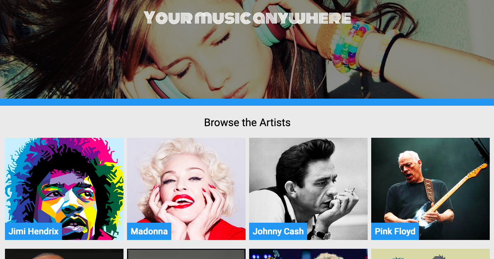
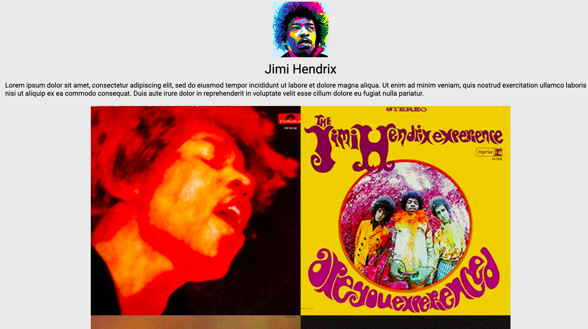

## Description

This project is a website that displays a list of music artists along with their discography and bio. 
The application uses a mock server to pull artist. 

## Run Application

To start the mock server, you need to install json-server and then run it.<br>
This snippet of code starts the server at port 3004.<br>

```
    npm install -g json-server
    json-server --watch db.json --port 3004
```
Use npm install to download all the node modules for this project and npm start to run it.
Open [http://localhost:3000](http://localhost:3000) to view it in the browser.

## Screenshots


<br>

